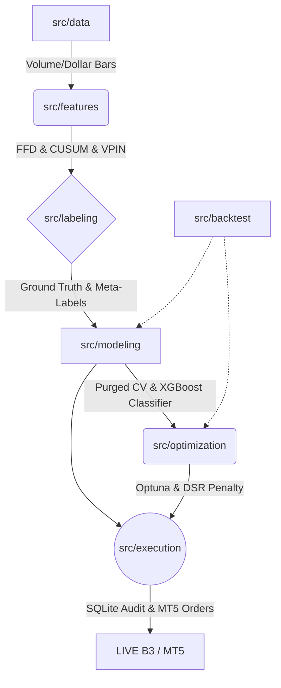

# TradeSystem5000 🚀
> "Em Machine Learning Financeiro, a modelagem dos dados é o navio. O classificador é apenas o motor."

O **TradeSystem5000** é muito mais que um bot de execução. É uma plataforma completa de pesquisa quantitativa, validação estatística e sistema de trading algorítmico *(Mid-Frequency Trading)* projetada para a bolsa brasileira (B3). Toda a engenharia deste repositório descarta o obsoleto e enviesado ML convencional (*"Venda se o RSI cruzar 70"*), alicerçando-se nas rígidas metodologias descritas no livro de cabeceira institucional *Advances in Financial Machine Learning (AFML)* de Marcos López de Prado.

Seu principal foco metodológico baseia-se em **Mitigação extrema de Overfitting (CPCV/DSR)**, **Separação Intencional de Sinais Secos e Probabilidades Secundárias (Meta-Labeling)** e **Alocação Exata Não-Linear Baseada na Probabilidade e Sobrevivência (Frações de Kelly Ajustadas)**.

---

## 🗺️ Mapa de Arquitetura e Engenharia do Software

A estrutura física do repositório reflete as 6 etapas matemáticas que precedem uma aposta lógica contra o mercado de capitais:



### Estrutura de Diretórios e Escopos

```text
tradesystem5000/
├── 📂 src/                     # Core Business Logic (O Pipeline Completo)
│   ├── 📂 data/                # [INGESTÃO] mt5_connector, Parquet Storage, Limpeza Z-Score de Spikes, Dollar Bars.
│   ├── 📂 features/            # [FÍSICA] Diferenciação Fracionária FFD, VPIN, Microestrutura OFI, Filtro CUSUM.
│   ├── 📂 labeling/            # [ALVOS] Tripla Barreira (Take Profit/Stop Loss dinâmico) e Meta-Labeling.
│   ├── 📂 modeling/            # [CÉREBRO] XGBoost, Purga/Embargo de Leakage, e Formula Kelly de Bet-Sizing.
│   ├── 📂 optimization/        # [TUNING] Optuna (TPE Bayesiano) com penalização Deflated Sharpe Ratio.
│   ├── 📂 backtest/            # [AUDITORIA] Combinatorial Purged CV, Slippage Models e Brazilian Cost Models B3.
│   └── 📂 execution/           # [FRONT-END] Loop Assíncrono para Live Trading com Circuit Breakers nativos.
├── 📂 data/                    # Banco de Dados Local
│   ├── 📄 tradesystem.db       # SQLite de Auditoria Transacional. (Seus robôs salvam os settings do mês aqui)
│   └── 📂 raw/ & processed/    # Base de Dados ultra-compactada via PyArrow Parquet (para carregar décadas de ticks em ms).
├── 📂 config/                  # Controle do Escopo de Fronteira
│   └── 📄 settings.py          # Limits Max Loss, Configuração Tickers, Kelly Fract, Timeouts e Paths.
└── 📂 tests/                   # Bateria massiva Pytest garantindo 80%+ de code-coverage livre de bugs de rede.
```

---

## 🧠 Funcionamento e Princípios do Motor AFML (Módulos em Detalhe)

A engenharia do TradeSystem5000 roda por um funil metódico:

### 1. Dados Saneados e Barras Alternativas (`src/data`)
Diferente da esmagadora maioria da literatura popular, este projeto não consome *"Barras OHLCV de 5 Minutos"*. Barras de tempo mascaram os regimes institucionais (uma barra vazia e parada na hora do almoço pesa o mesmo para uma RNA que uma barra ultra-violenta e massiva da abertura ou *Payroll*).
- **Dollar & Volume Bars**: O `bar_sampler.py` (acelerado em *Numba*) só constrói e recorta uma nova linha de DataFrame quando ocorre a troca literal de $X Contratos de Volume ou $X Milhões de Reais. A série resultante ganha Propriedades Estatísticas muito melhores, atenuando as caudas longas da distribuição (reduz *Kurtosis* e restaura normalidade I.I.D. basal essencial para o ML).

### 2. A Engenharia de Sinais Ocultos (`src/features`)
Não existe a "adivinhação de fundo e topo" de um analista visual. Criamos preditores numéricos:
- **FracDiff (Diferenciação Fracionária)**: Encontra a *d-th* raiz exata que aplaca tendências insustentáveis ao Teste de Estacionariedade (ADF), sem, no entanto, usar a matemática falha de log-returns normais que descartariam tragicamente o histórico imenso da memória dos suportes (Patamar Absoluto do Preço).
- **Microestrutura Assíncrona**: Usando as geniais aproximações métricas do VPIN (Volume-Synchronized Probability of Informed Trading) e OFI, as Features enxergam a pressão da predação do mercado de Book nas frações das próprias velas, sem poluir a CPU baixando L2 data em tempo real, informando ao Bot antecipadamente se o lado da oferta está evaporando artificialmente.
- **Normalização Time-Travel Free**: A normalização usa *Rolling Z-Score* contínuo. Usar funções globais padrão contamina toda a inteligência da amostra (*Look-ahead Bias* - você treina o dado de Janeiro usando conhecimentos vazados do Range de Dezembro).

### 3. A Arte da Rotulagem: Meta-Labeling e Tripla Barreira (`src/labeling`)
Os modelos quantitativos perdedores falham por pedir ao seu classificador para descobrir sozinho quando e como comprar/vender (0 = desce, 1 = sobe). Aqui partimos a responsabilidade:
- **Tripla Barreira**: Um labirinto vetorial rígido (Take Profit, Stop Loss e Tempo Expirado). As caixas mudam de tamanho de acordo com a EWM (Volatilidade elástica atual do Ativo).
- **Meta-Labeling**: Você usa algoritmos simplórios ou suposições base (Alfa Seco de Regressão à Média). Após engatilhar e rolar pela Barreira, o *XGBoost* aprende apenas como ser seu Gerente Pessoal, respondendo: *"Devo investir meu dinheiro sabendo dessa indicação de compra no contexto turbulento e de alta volatilidade local destas features ou ignoro porque serei estopado pelas barreiras?"* ($0$ ou $1$).

### 4. Isolamento do Treino contra Autocorrelação de Mercados (`src/modeling`)
O core que dita o fim do Overfitting Temporal.
- **Purga e Embargo (Purged CV)**: Um sinal no instante X gera uma "Aposta" que dura até o momento Y da semana. Os retornos dentro daquele espaço são auto-correlacionados. Se esse bloco cai na divisória de dobras de validações K-Fold para aprendizado, a máquina decora e trapaceia no teste oculto vazando retornos passados (*Data Leakage*). O `purge_embargo.py` varre o índice temporal de cruzamentos destruindo, descartando amostras redundantes de validação e introduzindo um abismo pós teste ("Embargo") de segurança cronológica.
- **Kelly Fracionário Ajustado (Bet-Sizing)**: Um classificador gera convicção (ex: $P(Gain) = 87\%$). Aplicamos a proporção na formula histórica do Teorema de Kelly. Se $P$ for esmagador e compensar o prêmio contra as barreiras empíricas em $t$, ele agressa pesado com alavancagem limite de contratos da B3. Se $P \le 55\%$ beirando o ruído local do acaso da taxa da casa de corretagem, ele aborta cravando o Lote ideal igual a $0$.

### 5. O Árbitro Universal do Viés de Otimização (`src/optimization` e `src/backtest`)
Qualquer configuração insana com limites chutados produz lucros incríveis se varrida milhões de vezes por grid search no mesmo ano financeiro.
- O Optuna coordena sob Busca Bayesiana TPE (*Tree-structured Parzen Estimator*). Na *Phase 1*, descobre magicamente se o seu Robô no "Ano Fiscal Y" deve rodar Alvos Largos e Stop-Curto ou o contrário baseado na maximização real. Na *Phase 2*, ajusta o *Learning-Rate* e hiper-profundidade da árvore de regressão binária XGBoost sem alterar a física anterior.
- **Deflated Sharpe Ratio (DSR)**: A guilhotina estatística final imposta. O Sharpe Ratio isolado não atesta nada contra a Sorte em múltiplos trials. O módulo `dsr.py` insere o Sharpe Máximo na função de limites de *Gumbel* validando sob testes de hipóteses estatísticas absolutas se o algoritmo encontrou, ou não, o Santo Graal com confiabilidade estrita $> 0.95$. Se o viés acusar mera perseguição de ruído populacional, descarta-se tudo como falsa glória.
- **Combinatorial Purged CV e Cost Model**: O relatorio transaciona a predição através do Atrapalhador Estocástico da Slippage Brasileira Base e desconta Custo e Emolumentos. A Combinatória fragmenta o tempo histórico em "Universos Alternativos" não sequenciais onde testamos na base inteira isolando se o Classificador é universal.

### 6. A Armadura Live Execution - Gestão de Risco e Front-end (`src/execution`)
É o braço que entra no campo de batalha do pregão ao vivo de São Paulo operando através da ponte Python-MQL5 do MetaTrader.
- **Engine Assíncrona Total**: Sem bloqueios e threads engasgadas. Monitora vários sub-relógios em `gather(WIN, WDO, PETR4)`.
- **Risco Contábil Absoluto (Circuit-Breakers)**: Tem as próprias variáveis em RAM traçadas para detectar *Max-Drawdowns* HWM intrabarras sub-minuto e Perdas Massivas Diárias isoladas na conta do trader, aplicando o "Halt e Liquidação" sumária das boletas se bater ou explodir $3\%$ da equidade, desligando a si mesmo e travando a ordem impiedosamente até o reset da meia noite do dia seguinte.
- **Auditoria Indestrutível**: Uma instância central SQLite escreve in-memory o carimbo literal do ID da agressão, o lote emitido de Kelly, o log se foi ou não preenchido pela Bolsa e a Exceção ocorrida em `audit_signals`, prevenindo o pesadelo analítico e cego da BlackBox no pós-mercado de sextas-feiras tristes onde o desenvolvedor HFT não sabe onde, porque e que robô quebrou a conta.

---

## 🚀 Guia Prático: Exemplos Extendidos de Operações e Sub-comandos

O ecossistema todo se interliga fluídamente do primeiro ping de rede MT5 em Janeiro de 2024 até a boleta live em Dezembro de 2025. Aqui vão os steps maduros de operação da stack:

### 1. Atualizar e Limpar a Matéria Prima Bruta do Mercado
Rodando para colher dados do mercado da fonte até a máquina da infra local de simulação:
```bash
# Sincronização inteligente: Traz as barras apenas do delta passado não guardado em data/raw/
python src/data/extractor.py --mode incremental --symbol WDO$ --interval 5m
```

### 2. Backtest Estatístico Cego e Purificado (O Laboratório)
Onde você analisa os retornos simulados com todas as métricas reais B3 em CPCV:
```bash
# Rodar 10.000 amostras usando as Dollar Bars geradas do WIN$ na B3 local sem ruído do MT5 Live
python src/main_backtest.py --mode mt5 --symbol WIN$ --n-bars 10000 --bars-type dollar
```

### 3. Deixando a IA Aprender Com o Mercado E Consolidar a Parametrização Otimizada
Quando o ambiente está limpo, ordene o robô Bayesiano do Optuna de Fase 1 e Fase 2 a fritar seus *cores* durante a noite com o melhor tuning possível de ML validado DSR.
```bash
# Aciona o classificador Bayesiano, testando e provando o modelo até validar um DSR > 0.95,
# então salva e exporta automaticamente o dicionário complexo no seu banco transacional .DB SQLite.
python src/optimization/run_opt.py --symbol WDO$ --trials 250
```

### 4. Ativando as Turbinas Assíncronas (Production Live)
Garante o disparo de mercado roteando na ponta com Circuit Breaker implacável. Sem Medo!
```bash
# Sobe e invoca o ambiente de AsyncIO.
# Importará em milissegundos toda a geometria salva no banco .DB do Optimize do dia anterior,
# se conectará e roteará, aplicando Bet Sizing com Kelly Fraction adaptativo tick por tick no pregão.
python src/main_execution.py --mode live
```

*(O mesmo comando pode ser rodado como `--mode paper` para simular e gravar a fita de fluxo no SQLite sem roteamento nativo, deixando de lado apenas o risco da derrapagem em live market pra fins de validação).*

---

## 🛠 Bibliografia Técnica Básica, Instalação Estendida e Limitações

### Requisitos Essenciais para Roteamento Live na Conta:
- Ambiente Windows local ou AWS EC2 Windows nativo ou Wine restrito (Bibliotecas de Proxy-Bridge da *MetaQuotes C++* API nativas para a lib python `MetaTrader5` são compiladas estritamente para Windows API DLLs). Em Linux você fará apenas modelagem quantitativa *in-vitro* ou *Paper* via mock.
- `Python >= 3.11`.
- Gestão central de pacote Python com ambiente purificado por meio de `uv` e orquestração por `pyproject.toml`.
- Os testes rodam desativando os loops JIT complexos do LLVM para garantir transparência nas asserções temporais de coverage interno. (Utilizar estritamente `NUMBA_DISABLE_JIT=1 pytest --cov=src` se for refatorar e aferir saúde da base matemática.)

### Leituras Exigidas de Formação Fundamental:
*   *Advances in Financial Machine Learning*, Marcos López de Prado (2018). (A Bíblia Fundamental desta arquitetura AFML completa de ponta a ponta)
*   *Machine Learning for Asset Managers*, Marcos López de Prado (2020). (DSR e Otimizações de Kelly contínuas sob Portfólio)
*   "Volume-Synchronized Probability of Informed Trading" (VPIN) Modelos Institucionais, Easley et al.
