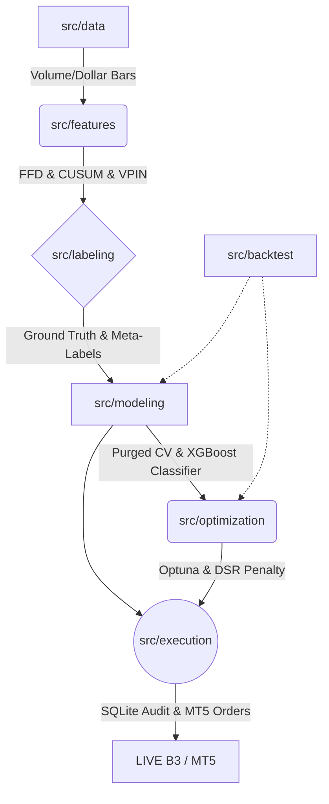

# TradeSystem5000

O **TradeSystem5000** é uma plataforma de pesquisa quantitativa, validação estatística e sistema de execução algorítmica focado em estratégias de média frequência (Mid-Frequency Trading). O projeto foi desenvolvido com base nos preceitos delineados na literatura de Financial Machine Learning, com ênfase particular nas metodologias estabelecidas por Marcos López de Prado (AFML).

O núcleo metodológico do sistema visa o endereçamento estrutural de três problemas comuns na aplicação de aprendizado de máquina em séries financeiras:
1.  **Mitigação de Overfitting**: Utilização de validação cruzada purgada (Combinatorial Purged Cross-Validation) e ajustes por viés de seleção (Deflated Sharpe Ratio).
2.  **Modelagem e Rotulagem Secundária (Meta-Labeling)**: Desacoplamento da sinalização direcional tática em relação ao dimensionamento e filtragem de falsos positivos.
3.  **Dimensionamento Dinâmico de Exposição**: Uso de inferências probabilísticas contínuas para alocação via frações do Critério de Kelly.

---

## Arquitetura e Engenharia do Software

O repositório está particionado de forma a refletir as etapas sequenciais do pipeline de processamento e execução:



### Organização de Diretórios

```text
tradesystem5000/
├── src/                        # Core Business Logic
│   ├── data/                   # Ingestão, Saneamento, Persistência Parquet e Amostragem (Volume/Dollar Bars).
│   ├── features/               # Transformação de dados: Diferenciação Fracionária FFD, VPIN, OFI, Filtro CUSUM.
│   ├── labeling/               # Processamento de Alvos: Tripla Barreira (Target dinâmico) e Meta-Labeling.
│   ├── modeling/               # Construção e Validação de Modelos: XGBoost, Purga/Embargo, Kelly Bet-Sizing.
│   ├── optimization/           # Otimização de Hiperparâmetros: Busca Bayesiana TPE (Optuna) e DSR Penalty.
│   ├── backtest/               # Simulação Institucional: Combinatorial Purged CV, Slippage Models e Custos B3.
│   └── execution/              # Engine: Event-loop assíncrono para Live/Paper Trading com roteamento via MT5.
├── data/                       # Armazenamento e Estado Local
│   ├── tradesystem.db          # Repositório SQLite para auditoria de sinais, rastreabilidade de risco e armazenamento de hiperparâmetros.
│   └── raw/ & processed/       # Arquivos de dados empacotados em Apache Parquet para otimização de I/O em análises locais.
├── config/                     # Definições globais (limiares de risco estático, topologia de ativos e credenciais).
└── tests/                      # Cobertura de verificação do sistema utilizando pytest, pytest-asyncio e mocks estruturais.
```

---

## Resumo dos Componentes do Sistema

### 1. Ingestão e Processamento (`src/data`)
O módulo de dados trata das anomalias inerentes ao roteamento da bolsa, removendo variações de cotação atípicas ("bad-ticks") via filtros Z-Score adaptativos. Em sequência, ao invés da sumarização convencional em barras temporais cronológicas (Time Bars), implementa amostragem por volume transacionado (Volume Bars) ou financeiro (Dollar Bars) para contornar a não-estacionariedade da variação inter-diária.

### 2. Engenharia de Variáveis (`src/features`)
Foca na extração estatística de informação da microestrutura do mercado, preservando a memória quantitativa das séries temporais.
- **Diferenciação Fracionária (FFD)**: Retira as tendências mantendo dependência de longo alcance temporal (preservando o histórico de níveis de suporte).
- **Microestrutura (VPIN e OFI)**: Modela aproximações do nível de assimetria do fluxo de ordem dentro da formação da barra.
- **Normalização Extensiva**: Padronização dos *inputs* orientada estritamente no tempo presente ($t$) via janela expansiva, com o objetivo primário de prevenção de vazamento do futuro (*Look-ahead Bias*).

### 3. Rotulagem (`src/labeling`)
Aplica o método do Meta-Labeling para formular a classificação a ser enviada ao algoritmo de aprendizagem secundário.
- **Tripla Barreira**: Um simulador determinístico de trajetória com limiares atrelados à volatilidade EWM e um limite de tempo pré-determinado, categorizando as saídas em ganhos, perdas ou inércia temporal.
- **Meta-Labeling**: Desloca o modelo secundário de decidir a *direção* das cotações, solicitando que a árvore de decisão atue unicamente filtrando e mensurando a confiabilidade das projeções direcionais enviadas por uma lógica Alpha primária.

### 4. Validação Cruzada e Posicionamento (`src/modeling` & `src/backtest`)
Arquitetura construída inteiramente para anulação do sobreajuste estatístico inerente ao retreinamento do ML financeiro.
- **Purged K-Fold CV**: Avaliação das métricas utilizando métodos de eliminação combinada de amostras que sofram overlap na borda do split de treino/teste e adição de um intervalo temporal inativo (Embargo) em que o serial-momentum impede o isolamento das informações do teste.
- **Critério de Kelly Fracionário**: Função conversora contínua de escalonamento paramétrico, atribuindo pesos de risco em Lotes que sobem ou descem de forma assintótica baseada exclusivamente no limite preestabelecido da certeza matemática (predict_proba).
- **Combinatorial Purged CV e DSR**: Reconstrução de combinações de matrizes de retornos independentes em simulações para obter, via validação de Testes de Hipótese (Deflated Sharpe Ratio), a constatação p-valor de probabilidade indicando que o prêmio da estratégia supera o fator de aleatoriedade dos testes estressados exaustivamente.

### 5. Sintonia Autônoma de Hiperparâmetros (`src/optimization`)
Emprega o algoritmo Bayesiano TPE em duas fases (Phase 1 e Phase 2). O pipeline divide logicamente o teste paramétrico das razões estáticas dos canais da estratégia e, em seguida, parametriza e re-avalia internamente os vetores da floresta aleatória e da taxa de gradiente, armazenando e delegando resultados sob validação DSR.

### 6. Execução Assíncrona e Risco (`src/execution`)
Abordagem em arquitetura *Non-Blocking*, orquestrando requisições paralelas à API nativa do MetaTrader 5 sem sobreposição bloqueante na esteira do interpretador. Executa checagens periódicas nos sub-buffers do Broker de forma a conciliar limites computados contra encerramentos locais de Take-Profit de mercado e engatilha restrições rigorosas e centralizadas (Max Drawdown Corrente e Limite Estático Diário).

---

## Guia Básico de Operação

O ecossistema é preparado via linha de comando para suportar processamentos independentes de etapa a etapa.

### 1. Ingestão de Dados Históricos
Para extrair um delta de cotações pendentes da corretora sem sobrescrever bases locais.
```bash
python src/data/extractor.py --mode incremental --symbol WDO$ --interval 5m
```

### 2. Backtest e Simulação Institucional
Realiza simulações computando atrito (Slippage) utilizando amostragens indexadas por volume financeiro.
```bash
python src/main_backtest.py --mode mt5 --symbol WIN$ --n-bars 10000 --bars-type dollar
```

### 3. Ajuste de Parâmetros
Executa a sintonia Bayesiana salvando no banco de dados instâncias estatisticamente válidas.
```bash
python src/optimization/run_opt.py --symbol WDO$ --trials 250
```

### 4. Execução Contínua em Tempo Real
Inicia a coleta, inferência e roteamento integrado via loop assíncrono.
```bash
python src/main_execution.py --mode live
```
*(Para uso sem envio oficial à rede, aplicar `--mode paper` visando log-audit em SQLite).*

---

## Requisitos e Restrições Sistêmicas

- **Dependência Nativa C++**: O pacote oficial `MetaTrader5` possui compilação restrita aos ambientes da API Windows (`win_amd64`). A execução Live via corretora, consequentemente, é atrelada nativamente ao S.O. Microsoft (Local ou instâncias virtuais), impossibilitando implantações *headless* sobre arquiteturas Linux a menos que via camada de emulação (Wine) ou utilizando o sistema exclusivamente para Paper e Modeling (via Mocks e cache parquet).
- **Interpretador e Pacotes**: Dependência estrita para `Python >= 3.11`. As resoluções estruturais transitivas encontram-se fixadas via utilitário de ambiente virtual `uv` pelo arquivo principal `pyproject.toml`.
- **Cobertura e Verificação**: A presença de código compilado via instrução `numba.njit` pode interferir em sondagens e mapeamentos durante avaliação de cobertura. Recomenda-se para refatorações: `NUMBA_DISABLE_JIT=1 pytest --cov=src`.

### Base Bibliográfica Referencial
*   López de Prado, M. (2018). *Advances in Financial Machine Learning*. John Wiley & Sons.
*   López de Prado, M. (2020). *Machine Learning for Asset Managers*. Cambridge University Press.
*   Easley, D., López de Prado, M., & O'Hara, M. (2012). *The Volume Clock: Insights into the High Frequency Paradigm*.
